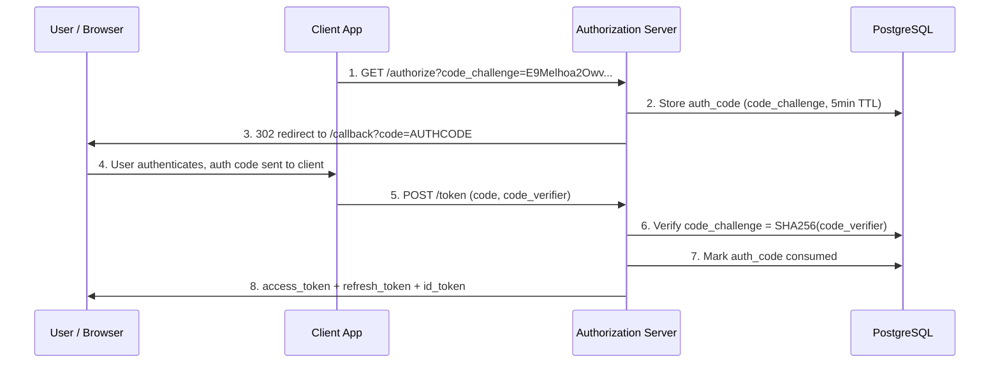
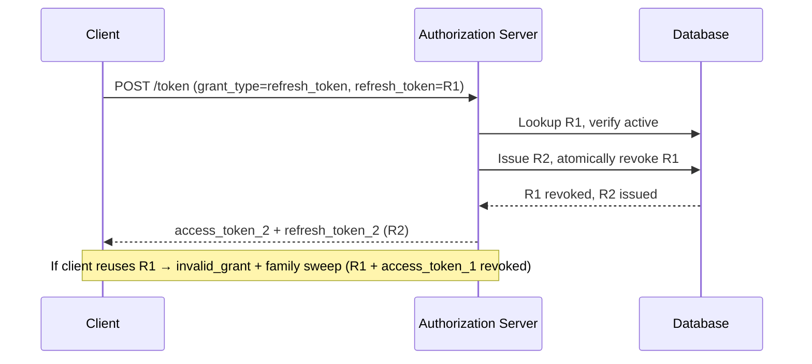
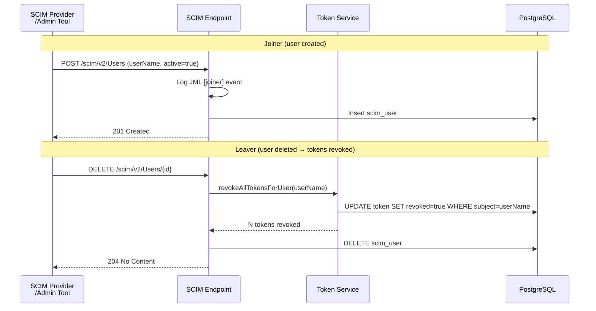
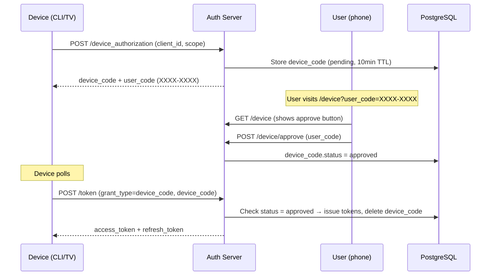
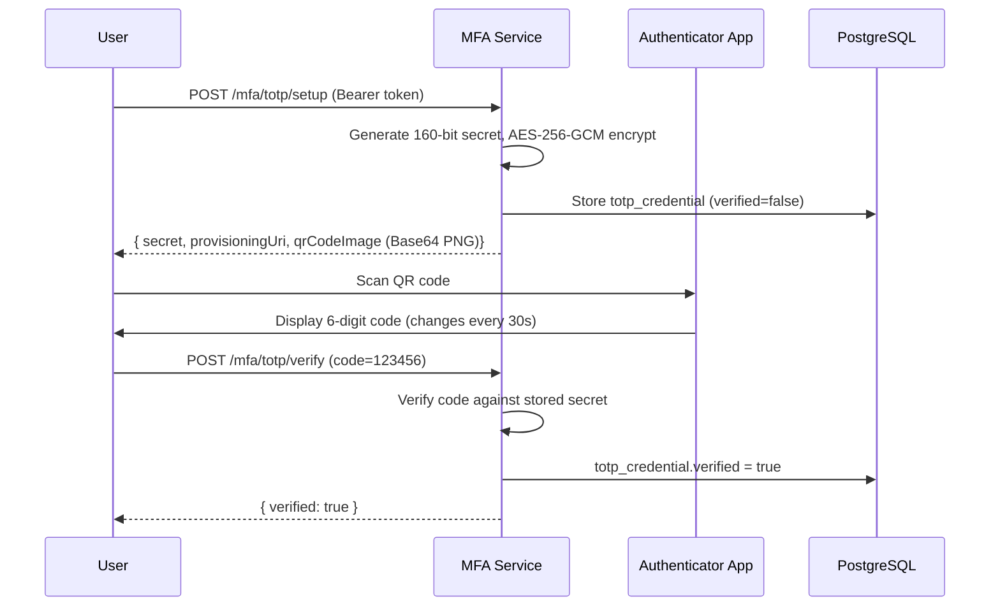

# IAM Protocol Engine

**RFC-level IAM from scratch** — OAuth 2.0, OIDC, SAML 2.0, SCIM 2.0, WebAuthn, TOTP, Device Flow.

> [!note]
> This is a portfolio demo, not a product. Every protocol is implemented by hand to RFC specification to demonstrate deep understanding of how identity protocols actually work — not to replace Keycloak, but to understand *why* Keycloak behaves the way it does.

---

## Status

| Phase | Status |
|-------|--------|
| Phase 1 — Bootstrap | ✅ Complete |
| Phase 2 — OAuth 2.0 Core | ✅ Complete |
| Phase 3 — OIDC Layer | ✅ Complete |
| Phase 4 — Token Lifecycle | ✅ Complete |
| Phase 5 — Admin UI | ✅ Complete |
| Phase 6 — SCIM 2.0 | ✅ Complete |
| Phase 7 — SAML 2.0 SP | ✅ Complete |
| Phase 8 — Modern Auth (MFA) | ✅ Complete |
| Phase 9 — Demo Hardening | ✅ Complete |

---

## What This Project Demonstrates

- **OAuth 2.0 Auth Code + PKCE** — RFC 6749 + RFC 7636. Code challenge, code verifier, exact `redirect_uri` matching.
- **OIDC** — Discovery (`/.well-known/openid-configuration`), JWKS with key rotation, RS256 ID tokens, `/userinfo`.
- **Token Lifecycle** — Refresh token rotation with family binding, token introspection (RFC 7662), revocation (RFC 7009).
- **SCIM 2.0** — Full `/Users` and `/Groups` CRUD per RFC 7644. Joiner/Mover/Leaver lifecycle wired to token revocation.
- **SAML 2.0 SP** — Signed `AuthnRequest`, HTTP-POST ACS, 7-step assertion validation, SAML → OIDC bridge.
- **MFA** — TOTP (RFC 6238) with AES-256-GCM secret encryption; WebAuthn/FIDO2 with `sign_count` anti-cloning.
- **Device Authorization Grant** — RFC 8628 for CLI, smart TV, and input-constrained devices.
- **Admin UI** — React 19 + Vite + MUI, PKCE login flow, client management, audit log viewer.

---

## Quick Start

```bash
# 1. Start infrastructure
docker compose -f infra/docker-compose.yml up -d

# 2. Run database migrations
./mvnw flyway:migrate -pl backend/auth-core

# 3. Start the backend
./mvnw spring-boot:run -pl backend/api-gateway

# 4. Run the full demo (all protocols)
./scripts/demo-e2e.sh
# Or quick OAuth + OIDC only:
./scripts/demo-e2e.sh --quick
```

Verify the app is running:

```bash
curl http://localhost:8080/actuator/health
# → {"status":"UP"}
```

---

## Architecture

### Module Layout

```
iam-protocol-engine/
├── backend/
│   ├── auth-core/          # JPA entities, AuditService, repositories
│   │   └── db/migration/  # Flyway migrations
│   ├── oauth-oidc/         # /authorize, /token, OIDC discovery, JWKS
│   ├── saml-federation/    # SAML SP, ACS, SAML→OIDC bridge
│   ├── scim/               # SCIM 2.0 /Users, /Groups
│   ├── mfa/                # TOTP + WebAuthn
│   ├── device-flow/        # RFC 8628 Device Authorization Grant
│   ├── demo-resource/      # Protected sample API
│   └── api-gateway/        # Spring Boot entry point
├── frontend/
│   └── app/               # React 19 + Vite + MUI (admin UI + learning site)
├── scripts/
│   └── demo-e2e.sh        # End-to-end demo script
└── infra/
    └── docker-compose.yml  # PostgreSQL 16 + Redis 7
```

`auth-core` is the only module with JPA entities. All other modules depend on it.

### Data Model

| Table | Key Fields |
|-------|-----------|
| `oauth_client` | `client_id` PK, `client_secret_hash`, `redirect_uris`, `allowed_scopes`, `grant_types` |
| `auth_code` | `code` PK, `client_id` FK, `subject`, `code_challenge`, `expires_at`, `consumed_at` |
| `token` | `jti` PK, `type`, `client_id` FK, `subject`, `scope`, `expires_at`, `revoked`, `family_id` |
| `scim_user` | `id` UUID PK, `user_name` UNIQUE, `emails`, `display_name`, `active`, `groups`, `attributes` JSONB |
| `scim_group` | `id` UUID PK, `display_name`, `members`, `attributes` JSONB |
| `webauthn_credential` | `credential_id` PK, `user_id`, `public_key_cose`, `sign_count`, `aaguid` |
| `totp_credential` | `id` UUID PK, `user_id` UNIQUE, `secret_encrypted` BYTEA, `verified` |
| `device_code` | `device_code` PK, `user_code` UNIQUE, `client_id`, `scope`, `status`, `expires_at` |
| `audit_event` | `id` PK, `event_type`, `actor`, `client_id`, `sub`, `jti`, `ip_address`, `details` JSONB |

Arrays (redirect_uris, scopes, groups) are stored as comma-separated TEXT — not JSON columns. `attributes` on SCIM entities is JSONB.

### Key Security Decisions

| Decision | Why |
|----------|-----|
| PKCE required for public clients | RFC 7636 — mitigates auth code interception |
| RS256 signing (no HS256) | Production tokens must use asymmetric keys |
| `redirect_uri` exact match | No pattern matching — prevents redirect URI injection |
| `kid` in JWKS from day one | Key rotation is designed in, not bolted on |
| Refresh token rotation | Old token invalidated atomically on reuse |
| TOTP secret encrypted at rest | AES-256-GCM with random IV per encryption |
| WebAuthn `sign_count` | Anti-cloning: credential becomes invalid after first use if cloned |
| Device code consumed on use | Single-use — prevents replay |
| PostgreSQL for short-lived state | Auth codes, device codes, refresh tokens; Redis reserved for caching |

---

## Protocol Flows

### OAuth 2.0 — Auth Code + PKCE



### Token Refresh — Rotation



### SCIM JML Lifecycle



### Device Authorization Grant — RFC 8628



### TOTP MFA Enrollment



---

## API Reference

### OAuth 2.0

| Method | Path | Description |
|--------|------|-------------|
| `GET` | `/oauth2/authorize` | Auth code entry point with PKCE |
| `POST` | `/oauth2/token` | Token exchange (auth code, client creds, refresh, device) |
| `POST` | `/oauth2/introspect` | RFC 7662 token introspection |
| `POST` | `/oauth2/revoke` | RFC 7009 token revocation |

### OIDC

| Method | Path | Description |
|--------|------|-------------|
| `GET` | `/.well-known/openid-configuration` | OIDC discovery metadata |
| `GET` | `/.well-known/jwks.json` | RSA public keys with `kid` |
| `GET` | `/userinfo` | OIDC claims (Bearer token required) |

### SCIM 2.0

| Method | Path | Description |
|--------|------|-------------|
| `POST` | `/scim/v2/Users` | Create user (joiner) |
| `GET` | `/scim/v2/Users` | List/search users |
| `GET` | `/scim/v2/Users/{id}` | Get user |
| `PUT` | `/scim/v2/Users/{id}` | Replace user (mover) |
| `DELETE` | `/scim/v2/Users/{id}` | Delete user (leaver) — revokes tokens |
| `POST` | `/scim/v2/Groups` | Create group |
| `GET` | `/scim/v2/Groups` | List/search groups |
| `GET` | `/scim/v2/Groups/{id}` | Get group with members |
| `PATCH` | `/scim/v2/Groups/{id}` | Add/remove members |

### SAML 2.0

| Method | Path | Description |
|--------|------|-------------|
| `GET` | `/saml/metadata` | Signed SP metadata XML |
| `GET` | `/saml/initiate` | Build and redirect with signed AuthnRequest |
| `POST` | `/saml/acs` | Assertion Consumer Service |

### MFA

| Method | Path | Description |
|--------|------|-------------|
| `POST` | `/mfa/totp/setup` | Generate TOTP secret + QR code |
| `POST` | `/mfa/totp/verify` | Verify TOTP code |
| `GET` | `/mfa/totp/status` | Check if TOTP enrolled |
| `POST` | `/webauthn/register/begin` | WebAuthn registration challenge |
| `POST` | `/webauthn/register/complete` | Complete WebAuthn registration |
| `POST` | `/webauthn/authenticate/begin` | WebAuthn authentication challenge |
| `POST` | `/webauthn/authenticate/complete` | Verify WebAuthn assertion |

### Device Flow

| Method | Path | Description |
|--------|------|-------------|
| `POST` | `/device_authorization` | RFC 8628 §3.1 — start device flow |
| `GET` | `/device` | User approval HTML page |
| `POST` | `/device/approve` | User approves device |

### Other

| Method | Path | Description |
|--------|------|-------------|
| `GET` | `/api/resource` | Protected sample API (validates Bearer token) |
| `GET` | `/actuator/health` | Health check |

---

## Learning Site

Interactive documentation at `frontend/app/` (Docusaurus):

```
https://hoimingkenny.github.io/iam-protocol-engine/
```

| Phase | Content |
|-------|---------|
| Phase 1 — Bootstrap | Maven modules, Docker Compose, JPA entities, API gateway |
| Phase 2 — OAuth 2.0 | PKCE, /authorize, /token, client credentials, demo-resource |
| Phase 3 — OIDC | Discovery, JWKS, ID token, /userinfo |
| Phase 4 — Token Lifecycle | Refresh rotation, introspection, revocation |
| Phase 5 — Admin UI | React scaffold, login flow, admin pages |
| Phase 6 — SCIM 2.0 | Users CRUD, Groups CRUD, JML lifecycle |
| Phase 7 — SAML 2.0 | SP metadata, AuthnRequest, ACS, SAML→OIDC bridge |
| Phase 8 — MFA | TOTP (RFC 6238), WebAuthn/FIDO2, Device Flow (RFC 8628) |

---

## Tech Stack

| Layer | Technology |
|-------|-----------|
| Language | Java 21 |
| Framework | Spring Boot 3.3 |
| OAuth/OIDC | Built by hand (not Spring Authorization Server) |
| SAML | OpenSAML 4.0 |
| Database | PostgreSQL 16 |
| Cache | Redis 7 |
| Migrations | Flyway |
| Frontend | React 19 + Vite + MUI |
| Docs | Docusaurus (MDX) |
| Container | Docker Compose |

---

## Test Accounts

Register a public client:

```sql
INSERT INTO oauth_client (client_id, client_secret_hash, redirect_uris, allowed_scopes, grant_types, is_public)
VALUES (
  'test-client',
  '',
  'https://app.example.com/callback',
  'openid profile email',
  'authorization_code',
  true
);
```

PKCE code verifier (RFC 7636 test vector):
```
code_verifier:  dBjftJeZ4CVP-mB92K27uhbUJU1p1r_wW1gFWFOEjXk
code_challenge: E9Melhoa2OwvFrEMTJguCHaoeK1t8URWbuGJSstw-cM
```
