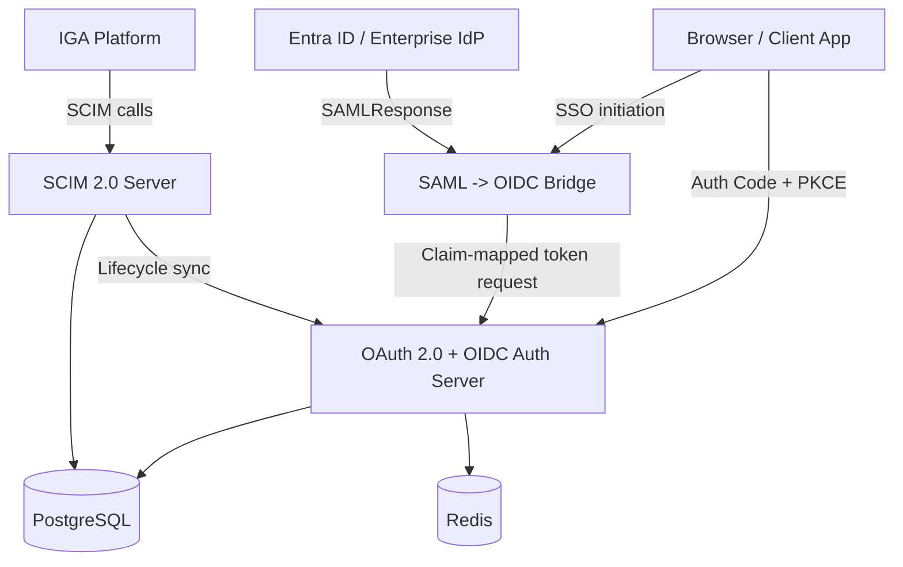

# IAM Protocol Engine - System Architecture

> [!abstract] Technical brief
> The technical source of truth for requirements, architecture, APIs, data model, non-functional requirements, and implementation plan.

---

## Functional Requirements

| ID | Priority | Requirement | Acceptance Criterion |
|----|----------|-------------|----------------------|
| FR-001 | Must | OAuth 2.0 Authorization Code flow with PKCE | Client completes auth, exchanges `code_verifier`, and receives tokens |
| FR-002 | Must | OAuth 2.0 Client Credentials flow | Machine client authenticates and receives scoped access token |
| FR-003 | Must | Refresh token issuance and rotation | Old refresh token invalidated on reuse |
| FR-004 | Must | Token introspection endpoint | Valid tokens return active metadata; revoked or expired tokens return inactive |
| FR-005 | Must | Token revocation endpoint | Revoked token becomes inactive immediately |
| FR-006 | Must | OIDC discovery + JWKS | Discovery and public keys available via standard endpoints |
| FR-007 | Must | ID token issuance | Signed RS256 ID token contains core claims |
| FR-008 | Must | SCIM 2.0 `/Users` CRUD | Spec-compliant create, read, update, and delete |
| FR-009 | Must | SCIM joiner / mover / leaver flows | Provisioning and deprovisioning work end to end |
| FR-010 | Should | SAML 2.0 SP-initiated SSO | Signed SAML assertion validated and accepted |
| FR-011 | Should | SAML to OIDC claim bridge | SAML attributes mapped into OIDC claims and tokens |
| FR-012 | Should | SCIM `/Groups` endpoint | Group lifecycle and membership changes supported |
| FR-013 | Could | OIDC userinfo endpoint | Returns claims consistent with ID token and scopes |
| FR-014 | Could | Dynamic client registration | Clients self-register per RFC 7591 |
| FR-015 | Should | WebAuthn registration | Valid WebAuthn registration challenge and stored credential |
| FR-016 | Should | WebAuthn authentication | Assertion verified and login proceeds |
| FR-017 | Should | Device Authorization Grant | CLI or headless device flow works per RFC 8628 |
| FR-018 | Should | TOTP MFA | Second-factor verification integrated into auth flow |

---

## Core Flows

### Authorization Code + PKCE

```text
User -> Client -> /authorize -> login -> auth code -> /token with code_verifier -> access token + ID token
```

### SAML SSO -> OIDC Token

```text
User -> SAML SP -> Enterprise IdP -> signed SAMLResponse -> claim mapping -> OIDC tokens
```

### SCIM Leaver

```text
IGA tool -> DELETE or PATCH /scim/v2/Users/{id} -> user disabled -> tokens revoked
```

### Device Flow

```text
Device/CLI -> /device_authorization -> user approves on browser -> device polls /token -> access token issued
```

---

## Scope

**In scope**
- OAuth 2.0 Authorization Code + PKCE, Client Credentials, token lifecycle
- OIDC discovery, JWKS, ID token, userinfo
- SAML 2.0 SP and SAML-to-OIDC bridge
- SCIM `/Users` and `/Groups`
- LDAP-backed directory lookup and group context integration
- Entra ID as the primary real-world federation and demo IdP
- WebAuthn, TOTP, Device Authorization Grant
- React admin console and protocol playground

**Out of scope**
- commercial IAM replacement
- broad connector ecosystem
- enterprise multi-tenant ops model

---

## Constraints And Assumptions

| Type | Detail |
|------|--------|
| Constraint | Build in Java / Spring Boot without turning the project into a thin Keycloak wrapper |
| Constraint | Prioritize correct protocol behavior over feature breadth |
| Assumption | Entra ID is the primary real SAML and modern enterprise IdP integration for the demo |
| Assumption | Local Docker Compose environment is sufficient |

---

## Architecture

### High-Level Architecture



### Recommended Stack

| Layer | Recommendation |
|------|----------------|
| Backend | `Java 21` + `Spring Boot` + `Spring Security` + `Spring Authorization Server` |
| SAML | `OpenSAML 5` |
| JWT / JWK | `Nimbus JOSE + JWT` |
| UI | `React` + `TypeScript` + `Vite` + `MUI` |
| Database | `PostgreSQL` |
| Short-lived state | `Redis` |
| Packaging | `Docker Compose` |

### Reference Platforms

| Platform | Role In This Project |
|---------|----------------------|
| `Entra ID` | Primary real-world IdP for federation and enterprise realism |
| `Keycloak` | Backup local IdP for faster isolated testing if needed |
| `SailPoint IIQ` | Real-world provisioning context that motivates SCIM lifecycle design |

### Components

| Component | Responsibility |
|-----------|----------------|
| OAuth 2.0 + OIDC Auth Server | Token issuance, validation, OIDC metadata, client registry |
| SAML -> OIDC Bridge | SAML SP flow, assertion validation, attribute-to-claim mapping |
| SCIM 2.0 Server | User and group lifecycle APIs |
| LDAP Integration Layer | Directory lookup, group resolution, and hybrid identity context |
| Entra ID Integration | Real-world federation target for SAML and enterprise identity testing |
| PostgreSQL | Persistent source of truth |
| Redis | Auth codes, nonce/state, revocation cache, short-lived challenges |
| React Admin Console | Login, admin CRUD, protocol playground, audit viewer |
| Protected Demo API | Verifies access tokens against a real resource |
| WebAuthn Module | Registration and assertion verification |
| TOTP Module | Second-factor generation and validation |
| Device Auth Module | Device flow issuance and polling state |

### Module Layout

| Module | Responsibility |
|--------|----------------|
| `backend/auth-core` | users, clients, scopes, sessions, audit base model |
| `backend/oauth-oidc` | authorize, token, discovery, JWKS, userinfo, introspection, revocation |
| `backend/saml-federation` | SP flows, metadata, ACS, assertion validation |
| `backend/scim` | `/Users`, `/Groups`, lifecycle flows |
| `backend/directory` | LDAP integration, user lookup, group mapping, directory context |
| `backend/mfa` | TOTP, WebAuthn, step-up auth |
| `backend/device-flow` | device grant issuance, approval, polling |
| `backend/demo-resource` | protected sample API |
| `frontend/app` | admin console and protocol playground |
| `infra` | local environment and config |

---

## Data Model

```text
Entity: OAuthClient
client_id, client_secret, redirect_uris, allowed_scopes, grant_types, created_at

Entity: AuthCode
code, client_id, subject, code_challenge, scope, expires_at

Entity: Token
jti, type, client_id, subject, scope, expires_at, revoked

Entity: ScimUser
id, username, email, active, attributes, created_at, updated_at

Entity: WebAuthnCredential
credential_id, user_id, public_key_cose, sign_count, aaguid, created_at

Entity: TotpCredential
user_id, secret, verified, created_at

Entity: DeviceCode
device_code, user_code, client_id, scope, status, expires_at, approved_by

Entity: DirectoryLink
user_id, directory_source, directory_dn, directory_groups, synced_at
```

---

## API Design

| Method | Endpoint | Purpose |
|--------|----------|---------|
| GET | `/authorize` | Auth Code + PKCE entry point |
| POST | `/token` | Authorization code, client credentials, refresh token, and device grant exchange |
| POST | `/introspect` | Token validation for resource servers |
| POST | `/revoke` | Token revocation |
| GET | `/.well-known/openid-configuration` | OIDC discovery |
| GET | `/.well-known/jwks.json` | Public signing keys |
| GET | `/userinfo` | OIDC claims endpoint |
| GET | `/saml/initiate` | SAML SP-initiated SSO start |
| POST | `/saml/acs` | SAML assertion consumer |
| GET | `/directory/users/{id}` | Read linked LDAP or directory context for a user |
| POST | `/scim/v2/Users` | SCIM joiner |
| PATCH | `/scim/v2/Users/{id}` | SCIM mover or deactivate |
| DELETE | `/scim/v2/Users/{id}` | SCIM leaver |
| GET | `/scim/v2/Groups` | SCIM groups and filtering |
| POST | `/device_authorization` | Device flow start |
| GET | `/device` | Human approval page for device flow |
| POST | `/webauthn/register/begin` | WebAuthn registration challenge |
| POST | `/webauthn/register/complete` | WebAuthn registration completion |
| POST | `/webauthn/authenticate/begin` | WebAuthn auth challenge |
| POST | `/webauthn/authenticate/complete` | WebAuthn auth completion |
| POST | `/mfa/totp/setup` | TOTP enrollment |
| POST | `/mfa/totp/verify` | TOTP verification |

---

## Non-Functional Requirements

| Attribute | Requirement | Notes |
|-----------|-------------|-------|
| Security | strict `redirect_uri` validation, PKCE enforcement, RS256 signing, SAML signature validation | no implicit flow |
| Performance | token issuance under normal load should stay fast | Redis used for TTL-heavy state |
| Reliability | SCIM operations idempotent where appropriate | revoked tokens return inactive consistently |
| Scalability | stateless validation through JWKS where possible | DB remains the source of truth |
| Observability | structured logs for auth, token, SCIM, SAML, MFA events | include `client_id`, `sub`, `scope`, `jti` |
| Compliance | audit-ready token and identity decision logging | suited to regulated environments |
| Interoperability | support LDAP-style enterprise directory integration without making LDAP the source of truth for the whole platform | keeps the demo realistic and bounded |

---

## Risks And Trade-Offs

| Risk / Trade-off | Impact | Mitigation |
|------------------|--------|------------|
| Building from scratch expands scope | Medium | Keep MVP narrow and protocol-first |
| SAML validation is easy to get wrong | High | Test against one real IdP and validate signature, audience, and conditions explicitly |
| SCIM breadth can sprawl | Medium | Prioritize `/Users` and lifecycle flows first |
| Frontend scope creep | Medium | Keep UI focused on demo-critical pages |
| LDAP can expand into a full directory-platform project | Medium | Keep LDAP focused on lookup, group mapping, and hybrid identity support only |

---

## Implementation Plan

### Week-by-Week MVP Build Plan

| Week | Focus | Done When |
|------|-------|-----------|
| 1 | Auth core | Auth Code + PKCE and Client Credentials work |
| 2 | OIDC surface | discovery, JWKS, ID token, introspection, revocation complete |
| 3 | SCIM core | `/Users` CRUD and lifecycle flows work |
| 4 | SAML bridge | SP-initiated SSO works with one IdP |
| 5 | UI polish | admin console, protocol playground, audit views work |
| 6 | Advanced auth | Device flow, TOTP, WebAuthn integrated |

### Delivery Order

1. OAuth 2.0 + OIDC core
2. Protected demo API
3. SCIM lifecycle flows
4. SAML bridge
5. Admin and audit UI
6. Device flow, TOTP, WebAuthn

### Tasks

- [ ] Implement Authorization Code + PKCE flow
- [ ] Implement Client Credentials flow
- [ ] Add refresh token rotation, introspection, and revocation
- [ ] Add OIDC discovery, JWKS, ID token, and userinfo
- [ ] Build React login, consent, admin, and audit pages
- [ ] Implement SCIM `/Users` and `/Groups`
- [ ] Build joiner / mover / leaver flows
- [ ] Add LDAP directory lookup and group-mapping integration path
- [ ] Implement SAML AuthnRequest and assertion validation
- [ ] Build SAML -> OIDC claim mapping
- [ ] Implement Device Authorization Grant
- [ ] Implement TOTP MFA
- [ ] Implement WebAuthn registration and authentication
- [ ] Write end-to-end demo scripts and architecture README

### Dependencies

- Entra ID or Keycloak for SAML testing
- Entra ID tenant or equivalent enterprise IdP setup for primary federation testing
- PostgreSQL and Redis
- Nimbus JOSE + JWT
- OpenSAML 5
- OpenLDAP or Active Directory-compatible directory for integration testing
- webauthn4j
- java-otp or equivalent
- React + TypeScript + Vite + MUI

### Open Questions

- Use Entra ID or Keycloak as the primary SAML integration?
- Keep SCIM in a separate module with a shared DB schema boundary?

---

## Related

- [[Projects/Personal/IAM Protocol Engine]]
- [[Projects/Personal/IAM Protocol Engine/01. Product Brief]]
- [[Projects/Personal/IAM Protocol Engine/03. Learning & Interview Notes]]
