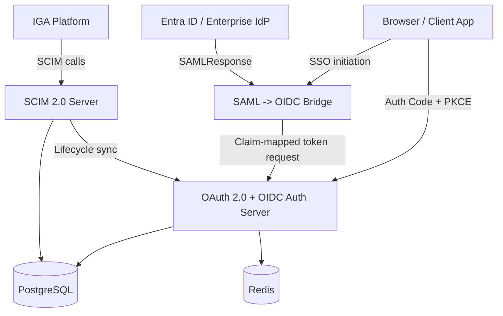

# System Architecture

> Technical source of truth for requirements, architecture, APIs, data model, NFRs, and implementation plan.

## Functional Requirements

| ID | Priority | Requirement | Acceptance Criterion |
|----|----------|-------------|----------------------|
| FR-001 | Must | OAuth 2.0 Authorization Code flow with PKCE | Client completes auth, exchanges code_verifier, and receives tokens |
| FR-002 | Must | OAuth 2.0 Client Credentials flow | Machine client authenticates and receives scoped access token |
| FR-003 | Must | Refresh token issuance and rotation | Old refresh token invalidated on reuse |
| FR-004 | Must | Token introspection endpoint | Valid tokens return active metadata; revoked or expired return inactive |
| FR-005 | Must | Token revocation endpoint | Revoked token becomes inactive immediately |
| FR-006 | Must | OIDC discovery + JWKS | Discovery and public keys available via standard endpoints |
| FR-007 | Must | ID token issuance | Signed RS256 ID token contains core claims |
| FR-008 | Must | SCIM 2.0 `/Users` CRUD | Spec-compliant create, read, update, and delete |
| FR-009 | Must | SCIM joiner / mover / leaver flows | Provisioning and deprovisioning work end to end |
| FR-010 | Should | SAML 2.0 SP-initiated SSO | Signed SAML assertion validated and accepted |
| FR-011 | Should | SAML to OIDC claim bridge | SAML attributes mapped into OIDC claims and tokens |
| FR-012 | Should | SCIM `/Groups` endpoint | Group lifecycle and membership changes supported |
| FR-013 | Could | OIDC userinfo endpoint | Returns claims consistent with ID token and scopes |
| FR-014 | Could | Dynamic client registration | Clients self-register per RFC 7591 |
| FR-015 | Should | WebAuthn registration | Valid WebAuthn registration challenge and stored credential |
| FR-016 | Should | WebAuthn authentication | Assertion verified and login proceeds |
| FR-017 | Should | Device Authorization Grant | CLI or headless device flow works per RFC 8628 |
| FR-018 | Should | TOTP MFA | Second-factor verification integrated into auth flow |

## Core Flows

### Authorization Code + PKCE

```
User → Client → /authorize → login → auth code → /token with code_verifier → access token + ID token
```

### SAML SSO → OIDC Token

```
User → SAML SP → Enterprise IdP → signed SAMLResponse → claim mapping → OIDC tokens
```

### SCIM Leaver

```
IGA tool → DELETE or PATCH /scim/v2/Users/{id} → user disabled → tokens revoked
```

## High-Level Architecture



## Module Layout

| Module | Responsibility |
|--------|----------------|
| `backend/auth-core` | JPA entities, AuditService, base repository |
| `backend/oauth-oidc` | authorize, token, discovery, JWKS, userinfo, introspection, revocation |
| `backend/saml-federation` | SP flows, metadata, ACS, assertion validation |
| `backend/scim` | `/Users`, `/Groups`, lifecycle flows |
| `backend/mfa` | TOTP, WebAuthn, step-up auth |
| `backend/device-flow` | device grant issuance, approval, polling |
| `backend/demo-resource` | protected sample API |
| `frontend/app` | admin console and protocol playground |

## API Design

| Method | Endpoint | Purpose |
|--------|----------|---------|
| GET | `/authorize` | Auth Code + PKCE entry point |
| POST | `/token` | Authorization code, client credentials, refresh token, device grant exchange |
| POST | `/introspect` | Token validation for resource servers |
| POST | `/revoke` | Token revocation |
| GET | `/.well-known/openid-configuration` | OIDC discovery |
| GET | `/.well-known/jwks.json` | Public signing keys |
| GET | `/userinfo` | OIDC claims endpoint |
| GET | `/saml/metadata` | SP metadata |
| GET | `/saml/initiate` | SAML SP-initiated SSO start |
| POST | `/saml/acs` | SAML Assertion Consumer Service |
| POST | `/scim/v2/Users` | Create SCIM user (joiner) |
| GET | `/scim/v2/Users` | List/search SCIM users |
| GET | `/scim/v2/Users/{id}` | Get SCIM user |
| PUT | `/scim/v2/Users/{id}` | Replace SCIM user (mover) |
| DELETE | `/scim/v2/Users/{id}` | Delete SCIM user (leaver) |
| POST | `/scim/v2/Groups` | Create SCIM group |
| GET | `/scim/v2/Groups` | List/search SCIM groups |
| GET | `/scim/v2/Groups/{id}` | Get SCIM group |
| PATCH | `/scim/v2/Groups/{id}` | Modify SCIM group membership |
| POST | `/device_authorization` | Device flow start |
| GET | `/device` | Human approval page for device flow |
| POST | `/webauthn/register/begin` | WebAuthn registration challenge |
| POST | `/webauthn/register/complete` | WebAuthn registration completion |
| POST | `/webauthn/authenticate/begin` | WebAuthn auth challenge |
| POST | `/webauthn/authenticate/complete` | WebAuthn auth verification |
| POST | `/mfa/totp/setup` | TOTP enrollment |
| POST | `/mfa/totp/verify` | TOTP verification |

## Non-Functional Requirements

| Attribute | Requirement |
|-----------|-------------|
| Security | strict `redirect_uri` validation, PKCE enforcement, RS256 signing, SAML signature validation |
| Performance | token issuance under normal load should stay fast (Redis for TTL-heavy state) |
| Reliability | SCIM operations idempotent where appropriate; revoked tokens return inactive consistently |
| Scalability | stateless validation through JWKS where possible; DB remains source of truth |
| Observability | structured logs for auth, token, SCIM, SAML, MFA events |
| Compliance | audit-ready token and identity decision logging |
